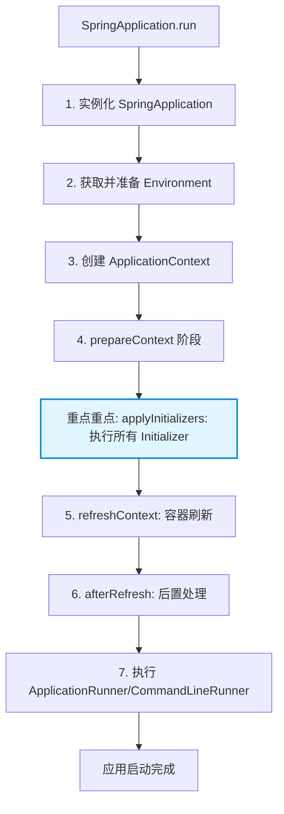
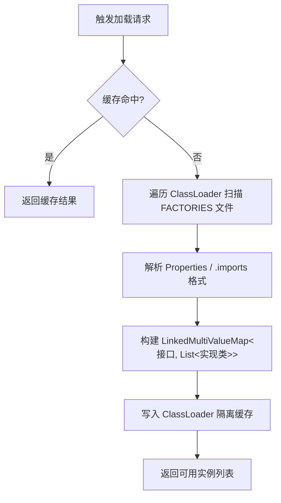

# spring-boot初始化器详解
[toc]
# 1.spring-boot初始化器的简介
`ApplicationContextInitializer`是Spring框架提供的一个回调接口
+ 触发时机： `ApplicationContext`实例已创建，但尚未执行`refresh()`之前
+ 上下文状态： `BeanFactory` 已初始化，`Environment` 已准备就绪，但所有 Bean 均未实例化
+ 设计目的：允许开发者在容器刷新前，对 `ApplicationContext` 进行基础设施级定制
+ 适用边界：注册 BeanDefinition、动态注入 PropertySource、修改 Environment、接入第三方配置中心、设置全局监听器等
接口定义如下
```java
@FunctionalInterface
public interface ApplicationContextInitializer<C extends ConfigurableApplicationContext> {
    void initialize(C applicationContext);
}
```
+ 典型高阶应用场景
  1. 动态注入自定义 PropertySource，在容器刷新前注入配置，确保后续 @Value、@ConfigurationProperties 可读取
  2. 提前注册基础设施 BeanDefinition，适用于需要在 refresh() 阶段被其他 Bean 依赖的底层组件（如自定义 BeanFactoryPostProcessor）
  3. 动态激活 Profile
  
  简单总结：ConfigurableApplicationContext+加载流程决定了作用，ConfigurableApplicationContext可以提供，初始化器是在什么阶段(`ApplicationContext`实例已创建，但尚未执行`refresh()`之前)。

# 2.spring-boot初始化的使用
所有的初始化器都必须要实现ApplicationContextInitializer接口，然后实现initialize(C applicationContext)方法，自定义逻辑，例子可以参考：
+ [AppleInitializer.java](src%2Fmain%2Fjava%2Forg%2Fnewjiang%2Fspringboot%2Finitializer%2FAppleInitializer.java)
+ [BananaInitializer.java](src%2Fmain%2Fjava%2Forg%2Fnewjiang%2Fspringboot%2Finitializer%2FBananaInitializer.java)
+ [CherryInitializer.java](src%2Fmain%2Fjava%2Forg%2Fnewjiang%2Fspringboot%2Finitializer%2FCherryInitializer.java)
## 2.1.SPI自动加载
例子：[AppleInitializer.java](src%2Fmain%2Fjava%2Forg%2Fnewjiang%2Fspringboot%2Finitializer%2FAppleInitializer.java)
1. 自定义编写完成AppleInitializer的逻辑：
2. 在[META-INF/spring.factories](src%2Fmain%2Fresources%2FMETA-INF%2Fspring.factories)添加如下配置，如下：
   ```properties
    # 注册初始化器，多个则以英文","分割
    org.springframework.context.ApplicationContextInitializer=初始化器类1,初始化器类2
   ```
## 2.2.编程式注册
例子：[BananaInitializer.java](src%2Fmain%2Fjava%2Forg%2Fnewjiang%2Fspringboot%2Finitializer%2FBananaInitializer.java)
1. 自定义编写完成BananaInitializer的逻辑：
2. 在启动类[JourneyApplication.java](src%2Fmain%2Fjava%2Forg%2Fnewjiang%2Fspringboot%2FJourneyApplication.java)，详见注释`代码注册初始化器-编程式注册`代码部分
   ```java
    SpringApplication springApplication = new SpringApplication(JourneyApplication.class);
    springApplication.addInitializers(new BananaInitializer()); // 添加监听器
    springApplication.run(args);
   ```
## 2.3.配置文件注册
例子：[CherryInitializer.java](src%2Fmain%2Fjava%2Forg%2Fnewjiang%2Fspringboot%2Finitializer%2FCherryInitializer.java)
1. 自定义编写完成CherryInitializer的逻辑：
2. 在配置文件[application.properties](src%2Fmain%2Fresources%2Fapplication.properties)，添加如下配置：
   ```properties
   # 注册监听器，多个以英文逗号","分割
   context.initializer.classes=org.newjiang.springboot.initializer.CherryInitializer
   ```
## 2.4.spring-boot初始化器的简介总结：
| 注册方式      | 作用范围                        | 优先级 | 适用场景                     |
| ---------- | ------------------------------- | ------ | ---------------------------- |
| **配置文件注册** | 仅当前应用                      | 中     | 快速集成、非库/框架级定制    |
| **SPI自动加载** | 全局（所有引入该 Jar 的应用）   | 低     | 编写 Starter、第三方框架桥接 |
| **编程式注册** | 仅当前 `SpringApplication` 实例 | 高     | 动态条件注册、测试环境定制   |
> 📌执行优先级：编程式 > 配置文件 > SPI 自动加载（同类型内部按 @Order 排序）

# 3.源码解读
`ApplicationContextInitializer` 并非 Spring Boot 独有，而是 Spring Framework 的标准扩展点。Spring Boot 在 SpringApplication.run() 流程中对其进行了封装与自动化加载。

## 3.1.流程走读
源码过程，下面从JourneyApplication开始走读流程，代码如下：
```java
SpringApplication.run(JourneyApplication.class, args);

// 先走走读SpringApplication的构造函数new SpringApplication(primarySources)部分
// new SpringApplication(primarySources).run(args)
```
1. SpringApplication的构造方法
```java
 public SpringApplication(ResourceLoader resourceLoader, Class<?>... primarySources) {
     this.resourceLoader = resourceLoader;
     Assert.notNull(primarySources, "PrimarySources must not be null");
     this.primarySources = new LinkedHashSet<>(Arrays.asList(primarySources));
     this.webApplicationType = WebApplicationType.deduceFromClasspath();
     // 1.重点-设置初始化器【从这里进入】
     setInitializers((Collection) getSpringFactoriesInstances(ApplicationContextInitializer.class));
     // 2.重点-设置监听器
     setListeners((Collection) getSpringFactoriesInstances(ApplicationListener.class));
     this.mainApplicationClass = deduceMainApplicationClass();
 }
```
2. 进入getSpringFactoriesInstances
```java
	private <T> Collection<T> getSpringFactoriesInstances(Class<T> type, Class<?>[] parameterTypes, Object... args) {
		ClassLoader classLoader = getClassLoader();
		// Use names and ensure unique to protect against duplicates // 【从这里进入】
		Set<String> names = new LinkedHashSet<>(SpringFactoriesLoader.loadFactoryNames(type, classLoader)); 
		List<T> instances = createSpringFactoriesInstances(type, parameterTypes, classLoader, args, names);
		AnnotationAwareOrderComparator.sort(instances);
		return instances;
	}
```
3. 找到loadSpringFactories(classLoader)，进入`SpringFactoriesLoader`类
```java
// 从类路径扫描并加载 META-INF/spring.factories 配置文件 返回格式：Map<接口/抽象类全限定名, List<实现类全限定名>>
private static Map<String, List<String>> loadSpringFactories(@Nullable ClassLoader classLoader) {
   // 【1. 缓存优先查询】
   // 使用 ClassLoader 作为缓存 Key，隔离不同类加载器环境下的 SPI 配置
   // 避免重复 IO 与 Properties 解析，显著提升热部署/多模块场景下的启动性能
   MultiValueMap<String, String> result = cache.get(classLoader);
   if (result != null) {
      return result; // 命中缓存直接返回，阻断后续磁盘扫描
   }

   try {
      // 【2. 全量类路径扫描】
      // 获取当前 ClassLoader 及所有父加载器能访问到的 FACTORIES_RESOURCE_LOCATION 文件
      // 典型路径：META-INF/spring.factories
      Enumeration<URL> urls = (classLoader != null ? classLoader.getResources(FACTORIES_RESOURCE_LOCATION) : ClassLoader.getSystemResources(FACTORIES_RESOURCE_LOCATION));

      // 初始化结果容器：LinkedMultiValueMap 保证同一 Key 下的实现类按扫描顺序存储
      // 该顺序直接影响后续 @Order 排序与执行优先级
      result = new LinkedMultiValueMap<>();
      // 【3. 遍历所有 Jar/Classpath 下的配置文件】
      while (urls.hasMoreElements()) {
         URL url = urls.nextElement();
         // 包装为 Spring 统一资源抽象，支持 classpath:/file:/jar: 等协议
         UrlResource resource = new UrlResource(url);

         // 解析 Properties 格式文件（自动处理 UTF-8、注释行 # / !、键值对分割）
         Properties properties = PropertiesLoaderUtils.loadProperties(resource);
         for (Map.Entry<?, ?> entry : properties.entrySet()) {
            // 提取 Key：通常是接口或抽象类的全限定名（如 ApplicationContextInitializer）
            String factoryClassName = ((String) entry.getKey()).trim();
            // 【4. 逗号分隔值解析】
            // 支持 value 配置为单个或多个实现类，如：com.example.A, com.example.B
            // StringUtils 工具类已内置去空格、处理尾逗号等边界容错逻辑
            for (String factoryName : StringUtils.commaDelimitedListToStringArray((String) entry.getValue())) {
               // 建立 1:N 映射关系，存入 MultiValueMap
               result.add(factoryClassName, factoryName.trim());
            }
         }
      }
      // 【5. 写入缓存】
      // 缓存底层通常为 ConcurrentReferenceHashMap，对 ClassLoader 使用弱引用
      // 防止动态类加载器卸载时引发内存泄漏（OOM）
      cache.put(classLoader, result);
      return result;
   }
   catch (IOException ex) {
      // 【6. Fail-Fast 异常策略】
      // SPI 配置加载失败属于致命错误，直接包装为 IllegalArgumentException 向上抛出
      // 阻断后续 Bean 实例化，避免“带病启动”导致难以追踪的运行时异常
      throw new IllegalArgumentException("Unable to load factories from location [" +
              FACTORIES_RESOURCE_LOCATION + "]", ex);
   }
}
```

4. SpringApplication对象的run(args)方法，前面我们走读的是SpringApplication构造方法
```java
public ConfigurableApplicationContext run(String... args) {
    // ================= 阶段 0：启动计时与基础环境准备 =================
    StopWatch stopWatch = new StopWatch();
    stopWatch.start(); // 开始记录应用启动总耗时（用于后续 StartupInfo 日志输出）
    
    ConfigurableApplicationContext context = null;
    // 收集异常报告器，用于在启动失败时提供结构化错误栈与诊断建议
    Collection<SpringBootExceptionReporter> exceptionReporters = new ArrayList<>();
    
    // 配置 Java 的 Headless 模式（服务器环境默认 true，避免依赖系统 GUI 库）
    configureHeadlessProperty();

    // ================= 阶段 1：加载事件监听器 & 广播启动事件 =================
    // 通过 SPI 加载 SpringApplicationRunListener 实现类（如 LoggingApplicationListener、ConfigFileApplicationListener 等）
    SpringApplicationRunListeners listeners = getRunListeners(args);
    // 广播 ApplicationStartingEvent：此时 Spring 容器尚未创建，仅标记启动流程开始
    listeners.starting();

    try {
        // ================= 阶段 2：参数解析与环境构建 =================
        // 封装命令行参数（支持 --key=value 或 --key 等格式）
        ApplicationArguments applicationArguments = new DefaultApplicationArguments(args);
        
        // 核心：创建并配置 Environment
        // 内部逻辑：加载 application.yml/properties、绑定系统属性/环境变量、激活 Profile
        // 广播 ApplicationEnvironmentPreparedEvent（此时可接入外部配置中心）
        ConfigurableEnvironment environment = prepareEnvironment(listeners, applicationArguments);
        
        // 配置 spring.beaninfo.ignore=true（跳过 JavaBeans 内省扫描，提升启动性能）
        configureIgnoreBeanInfo(environment);

        // ================= 阶段 3：打印 Banner =================
        // 读取 banner.txt 或自定义 Banner 实现，输出到控制台
        Banner printedBanner = printBanner(environment);

        // ================= 阶段 4：实例化 IoC 容器 =================
        // 根据 Web 类型创建对应的 ApplicationContext（如 AnnotationConfigServletWebServerApplicationContext）
        // ⚠️ 此时 BeanFactory 已创建，但所有 Bean 均未解析与实例化
        context = createApplicationContext();
        
        // 加载异常报告器（绑定到当前 Context，用于后续启动失败的错误诊断）
        exceptionReporters = getSpringFactoriesInstances(SpringBootExceptionReporter.class,
                new Class[] { ConfigurableApplicationContext.class }, context);

        // ================= 阶段 5：准备上下文（核心扩展点触发区） =================
        // 内部执行顺序：
        // 1. context.setEnvironment(environment)
        // 2. postProcessApplicationContext(context)（注册默认组件）
        // 3. applyInitializers(context) 👈 ApplicationContextInitializer 在此处被遍历执行！
        // 4. 广播 ApplicationContextInitializedEvent & ApplicationPreparedEvent
        prepareContext(context, environment, listeners, applicationArguments, printedBanner);

        // ================= 阶段 6：容器刷新（Bean 创建核心） =================
        // 委托给 AbstractApplicationContext.refresh()
        // 完成：BeanDefinition 加载 -> BeanFactoryPostProcessor 执行 -> Bean 实例化/初始化 -> 内置 Web 服务器启动等
        refreshContext(context);

        // ================= 阶段 7：刷新后置处理 =================
        // 空实现钩子，供子类在 refresh() 完成后执行自定义逻辑（默认不执行任何操作）
        afterRefresh(context, applicationArguments);

        // ================= 阶段 8：启动完成日志 & 执行 Runner =================
        stopWatch.stop(); // 停止计时
        if (this.logStartupInfo) {
            // 打印启动成功日志（包含主类名、启动耗时、激活的 Profile 等）
            new StartupInfoLogger(this.mainApplicationClass).logStarted(getApplicationLog(), stopWatch);
        }
        
        // 广播 ApplicationStartedEvent：容器已完全刷新，但 Runner 尚未执行
        listeners.started(context);
        
        // 按 @Order 排序并执行所有 ApplicationRunner 与 CommandLineRunner
        callRunners(context, applicationArguments);
        
    } catch (Throwable ex) {
        // 启动异常统一处理：关闭上下文（若已创建）、广播失败事件、触发异常报告器输出
        handleRunFailure(context, ex, exceptionReporters, listeners);
        throw new IllegalStateException(ex);
    }

    try {
        // ================= 阶段 9：应用就绪 =================
        // 广播 ApplicationReadyEvent：应用已完全启动，内置 Tomcat/Reactor 等已监听端口，可接收外部流量
        listeners.running(context);
    }
    catch (Throwable ex) {
        handleRunFailure(context, ex, exceptionReporters, null);
        throw new IllegalStateException(ex);
    }
    // 返回完全初始化的 IoC 容器供外部持有
    return context;
}
```
5. prepareContext(context, environment, listeners, applicationArguments, printedBanner) 代码
```java
/**
 * 准备 ApplicationContext 上下文（连接环境构建与容器刷新的核心桥梁）
 * 执行时机：createApplicationContext() 之后，refreshContext() 之前
 * 核心职责：绑定环境 → 执行初始化器 → 注册单例 → 加载用户配置源
 */
private void prepareContext(ConfigurableApplicationContext context, 
                           ConfigurableEnvironment environment,
                           SpringApplicationRunListeners listeners, 
                           ApplicationArguments applicationArguments, 
                           Banner printedBanner) {

    // ================= 步骤 1：绑定 Environment =================
    // 将已准备好的 Environment（含 Profile/PropertySource）注入到 Context
    // ⚠️ 此时可通过 context.getEnvironment() 读取所有配置，但尚不可获取业务 Bean
    context.setEnvironment(environment);

    // ================= 步骤 2：后置处理 ApplicationContext =================
    // 执行 ApplicationContext 的标准化后处理（空实现钩子，供子类扩展）
    // 默认逻辑：设置资源加载器、类加载器、应用 ID 等基础属性
    postProcessApplicationContext(context);

    // ================= 步骤 3：【核心扩展点】执行 ApplicationContextInitializer =================
    // 遍历所有已注册的 Initializer，依次调用 initialize(context)
    // 🎯 典型用途：动态注册 BeanDefinition、注入自定义 PropertySource、激活 Profile
    // ⚠️ 此时 BeanFactory 已就绪，但所有业务 Bean 均未实例化，禁止调用 getBean()
    applyInitializers(context);

    // ================= 步骤 4：广播 ApplicationContextInitializedEvent =================
    // 通知所有 SpringApplicationRunListener：上下文已初始化完成，即将加载 BeanDefinition
    // 📌 监听器可在此阶段介入，但依然不可获取业务 Bean
    listeners.contextPrepared(context);

    // ================= 步骤 5：打印启动信息（可选） =================
    if (this.logStartupInfo) {
        // 打印应用版本、JVM 参数、启动类、父容器信息等（仅当无父容器时打印主类信息）
        logStartupInfo(context.getParent() == null);
        // 打印当前激活的 Profile 列表（如 [dev, mysql]），便于多环境调试
        logStartupProfileInfo(context);
    }

    // ================= 步骤 6：注册 Boot 专属单例 Bean =================
    // 获取底层 BeanFactory，用于手动注册基础设施单例
    ConfigurableListableBeanFactory beanFactory = context.getBeanFactory();
    
    // 注册 "springApplicationArguments"：封装命令行参数，支持 @Autowired 直接注入
    beanFactory.registerSingleton("springApplicationArguments", applicationArguments);
    
    // 注册 "springBootBanner"：封装 Banner 内容，支持在 Bean 中引用或自定义输出
    if (printedBanner != null) {
        beanFactory.registerSingleton("springBootBanner", printedBanner);
    }

    // ================= 步骤 7：配置 Bean 定义覆盖策略 =================
    // 若为 DefaultListableBeanFactory（标准实现），设置是否允许同名 BeanDefinition 覆盖
    // 🎯 生产环境建议设置为 false（this.allowBeanDefinitionOverriding = false），避免隐式覆盖导致业务异常
    if (beanFactory instanceof DefaultListableBeanFactory) {
        ((DefaultListableBeanFactory) beanFactory)
                .setAllowBeanDefinitionOverriding(this.allowBeanDefinitionOverriding);
    }

    // ================= 步骤 8：加载用户配置源（@Configuration / @Component） =================
    // 获取所有启动源：包括主类（@SpringBootApplication）、显式添加的 @Configuration 类、XML 配置等
    Set<Object> sources = getAllSources();
    Assert.notEmpty(sources, "Sources must not be empty"); // 防御式校验，避免空启动
    
    // 核心加载逻辑委托给 AnnotatedBeanDefinitionReader / XmlBeanDefinitionReader
    // 🎯 此时将所有 @Bean、@Component、@Import 解析为 BeanDefinition 注册到 BeanFactory
    // ⚠️ 仅注册元数据，不实例化！实例化将在下一步 refreshContext() 中统一触发
    load(context, sources.toArray(new Object[0]));

    // ================= 步骤 9：广播 ApplicationPreparedEvent =================
    // 通知所有监听器：上下文已完全准备，所有 BeanDefinition 已加载，即将进入 refresh()
    // 🎯 这是最后一个可在 Bean 实例化前介入的扩展点（如动态修改 BeanDefinition）
    listeners.contextLoaded(context);
}
```
6. applyInitializers()方法
```java
protected void applyInitializers(ConfigurableApplicationContext context) {
   for (ApplicationContextInitializer initializer : getInitializers()) {
      Class<?> requiredType = GenericTypeResolver.resolveTypeArgument(initializer.getClass(),
              ApplicationContextInitializer.class);
      Assert.isInstanceOf(requiredType, context, "Unable to call initializer.");
      initializer.initialize(context);
   }
}
```
流程图

## 3.1.SpringFactoriesLoader的作用

| 作用维度  | 具体能力                                                     | 架构价值                                              |
| ----- | ------------------------------------------------------------ | ----------------------------------------------------- |
| 自动化发现 | 扫描 Classpath 下所有 Jar 包的 `META-INF/spring.factories`（或 `.imports`） | 消除硬编码，实现“引入即生效”的插件化架构              |
| 1:N 映射管理 | 一个接口/抽象类可绑定多个实现类，保留加载顺序                | 支持多实现并存、链式处理、责任链模式                  |
| Fail-Fast 机制 | 文件不存在、格式错误、类找不到时立即抛出异常阻断启动         | 避免“带病启动”，降低运行时排查成本                    |



