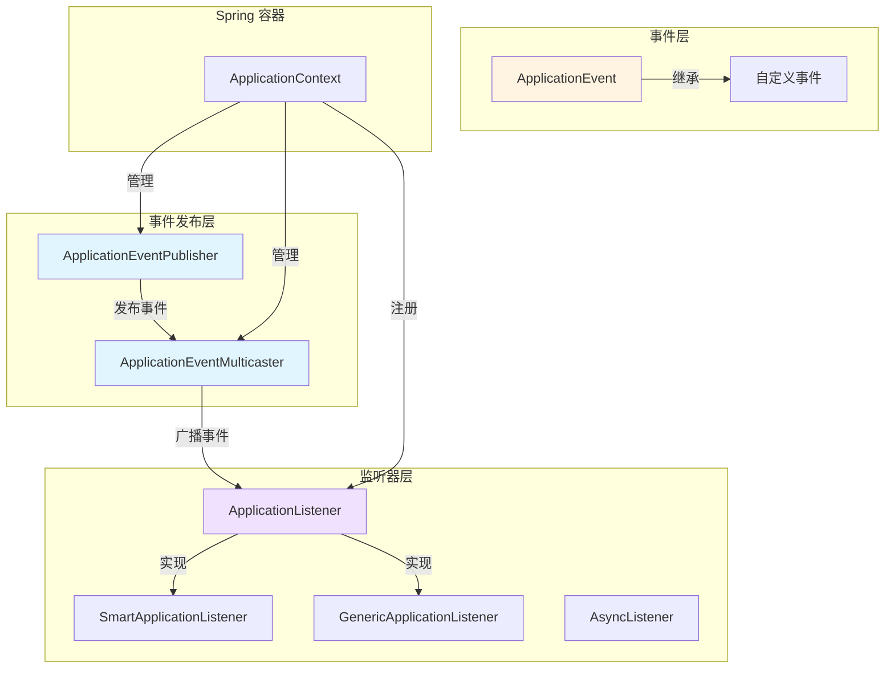
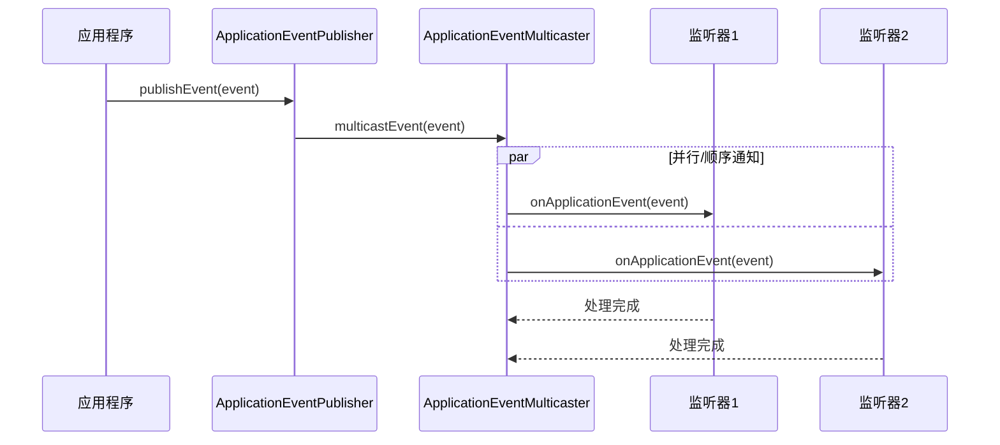
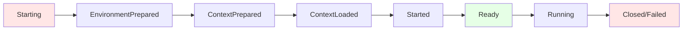
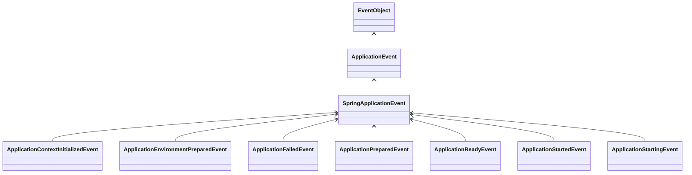
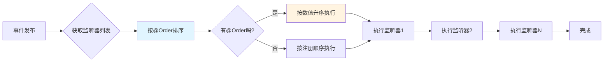

# Spring-Boot监听器
[toc]
# 1.spring-boot监听器的简介
Spring Boot 监听器（Listener）是Spring 框架事件驱动模型的核心组件，基于**观察者模式**（Observer Pattern）实现。它允许应用程序中的组件在特定事件发生时得到通知并做出响应，实现了组件之间的**解耦**和**异步通信**。

设计模式详见：[org/newjiang/springboot/listener/designpattern/Application.java](src%2Fmain%2Fjava%2Forg%2Fnewjiang%2Fspringboot%2Flistener%2Fdesignpattern%2FApplication.java)

模式4要素：`事件`、`监听器`、`广播`、`触发时机`    

+ 核心优势

| 优势         | 说明                                       |
| ------------ | ------------------------------------------ |
| **解耦**     | 事件发布者和监听者无需直接引用，降低耦合度 |
| **扩展性**   | 可以轻松添加新的监听器而不影响现有代码     |
| **灵活性**   | 支持同步/异步处理，支持事务管理            |
| **可维护性** | 关注点分离，代码结构更清晰                 |

+ 适用场景
  + 应用启动/关闭时的初始化/清理工作
  + 业务逻辑的异步处理（如发送邮件、短信）
  + 审计日志记录
  + 缓存更新
  + 数据同步
  + 监控告警

# 2.Spring 事件机制核心架构
核心接口说明:

| 接口/类                         | 作用                     | 包路径                              |
| ------------------------------- | ------------------------ | ----------------------------------- |
| **ApplicationEvent**            | 所有事件的基类           | `org.springframework.context`       |
| **ApplicationListener<E>**      | 事件监听器接口           | `org.springframework.context`       |
| **ApplicationEventPublisher**   | 事件发布器接口           | `org.springframework.context`       |
| **ApplicationEventMulticaster** | 事件广播器               | `org.springframework.context.event` |
| **ApplicationContext**          | 应用上下文（实现发布器） | `org.springframework.context`       |

## 2.1.核心组件关系图



## 2.2.事件处理流程



# 3.监听器类型详解

1. ApplicationListener（基础监听器） ，例子：[DemoApplicationListener.java](src%2Fmain%2Fjava%2Forg%2Fnewjiang%2Fspringboot%2Flistener%2FDemoApplicationListener.java)

2. SmartApplicationListener（智能监听器），例子：[DemoSmartApplicationListener.java](src%2Fmain%2Fjava%2Forg%2Fnewjiang%2Fspringboot%2Flistener%2FDemoSmartApplicationListener.java)

3. GenericApplicationListener（泛型监听器），例子：[DemoGenericApplicationListener.java](src%2Fmain%2Fjava%2Forg%2Fnewjiang%2Fspringboot%2Flistener%2FDemoGenericApplicationListener.java)

4. @EventListener 注解（推荐方式），例子：[DemoAnnotationEventListener.java](src%2Fmain%2Fjava%2Forg%2Fnewjiang%2Fspringboot%2Flistener%2FDemoAnnotationEventListener.java)


`ApplicationListener`/`SmartApplicationListener`/`GenericApplicationListener`可以通过下面的方式进行配置
1. 在[META-INF/spring.factories](src%2Fmain%2Fresources%2FMETA-INF%2Fspring.factories)添加如下配置，如下：
   ```properties
    # 注册监听器，多个则以英文","分割
    org.springframework.context.ApplicationListener=监听器1,监听器2
   ```
2. 在配置文件[application.properties](src%2Fmain%2Fresources%2Fapplication.properties)，添加如下配置：
   ```properties
   # 注册监听器，多个以英文逗号","分割
   context.listener.classes=监听器1,监听器2
   ```
3. 启动类添加
```java
SpringApplication springApplication = new SpringApplication(JourneyApplication.class);
springApplication.addListeners(new YourApplicationListener());
springApplication.run(args);
```
**监听器类型对比**：

| 特性           | ApplicationListener | SmartApplicationListener | @EventListener |
| -------------- | ------------------- | ------------------------ | -------------- |
| **实现复杂度** | 中等                | 较高                     | 低             |
| **支持多事件** | ❌                   | ✅                        | ✅              |
| **类型安全**   | ✅                   | ⚠️ 需手动判断             | ✅              |
| **条件监听**   | ❌                   |                          | ✅              |
| **执行顺序**   | @Order              | @Order                   | @Order         |
| **异步支持**   | 需手动              | 需手动                   | @Async         |
| **推荐度**     | ⭐⭐⭐                 | ⭐⭐                       | ⭐⭐⭐⭐⭐          |

# 4.Spring Boot 内置事件

应用生命周期事件:



内置事件详解表:

| 事件类                                  | 触发时机                               | 典型用途                                    |
| --------------------------------------- | -------------------------------------- | ------------------------------------------- |
| **ApplicationStartingEvent**            | 应用启动最早期，任何初始化之前         | 设置系统属性、环境变量                      |
| **ApplicationEnvironmentPreparedEvent** | Environment 创建后，Context 创建前     | 自定义 Environment、加载额外配置            |
| **ApplicationContextPreparedEvent**     | Context 创建后，刷新前                 | 修改 BeanDefinition、添加 BeanPostProcessor |
| **ApplicationStartedEvent**             | Context 刷新后，CommandLineRunner 之前 | 访问 ApplicationContext，但不依赖完全初始化 |
| **ApplicationReadyEvent**               | 应用完全启动，可以接受请求             | 发送启动通知、预热缓存                      |
| **ApplicationFailedEvent**              | 启动失败时                             | 清理资源、发送告警                          |
| **ContextClosedEvent**                  | Context 关闭时                         | 资源清理、保存状态                          |



**Servlet Web 应用特有事件**

| 事件类                               | 说明                           |
| ------------------------------------ | ------------------------------ |
| **ServletWebServerInitializedEvent** | Servlet Web 服务器初始化完成后 |
| **RequestHandledEvent**              | HTTP 请求处理完成后（需开启）  |

# 5.监听器执行机制

## 5.1.执行顺序控制



## 5.2.同步 vs 异步执行

代码例子：

```java
@Configuration
@EnableAsync
public class AsyncConfig {
    @Bean(name = "taskExecutor")
    public Executor taskExecutor() {
        ThreadPoolTaskExecutor executor = new ThreadPoolTaskExecutor();
        executor.setCorePoolSize(5);
        executor.setMaxPoolSize(10);
        executor.setQueueCapacity(100);
        executor.setThreadNamePrefix("event-listener-");
        executor.setRejectedExecutionHandler(new ThreadPoolExecutor.CallerRunsPolicy());
        executor.initialize();
        return executor;
    }
}
@Component
public class AsyncEventListeners {
    /**
     * 异步监听器
     */
    @Async("taskExecutor")
    @EventListener
    public void asyncHandle(MyEvent event) {
        log.info("异步处理事件，线程: {}", Thread.currentThread().getName());
    }
    /**
     * 同步监听器
     */
    @EventListener
    public void syncHandle(MyEvent event) {
        log.info("同步处理事件，线程: {}", Thread.currentThread().getName());
    }
}
```

**同步 vs 异步对比：**

| 特性         | 同步监听器               | 异步监听器           |
| ------------ | ------------------------ | -------------------- |
| **执行线程** | 发布者线程               | 线程池线程           |
| **阻塞性**   | 阻塞发布者               | 不阻塞发布者         |
| **事务传播** | 继承发布者事务           | 独立事务             |
| **异常处理** | 影响发布者               | 不影响发布者         |
| **性能**     | 较低                     | 较高                 |
| **适用场景** | 需要立即处理、事务一致性 | 耗时操作、非关键业务 |

# 6.高级特性

## 6.1.事件继承与层次结构

## 6.2.事件聚合与批量处理

## 6.3.事件过滤

## 6.4.事件链与编排

# 7.源码解读
详解：org.springframework.boot.SpringApplication的构造方法
```java
public SpringApplication(ResourceLoader resourceLoader, Class<?>... primarySources) {
    this.resourceLoader = resourceLoader;
    Assert.notNull(primarySources, "PrimarySources must not be null");
    this.primarySources = new LinkedHashSet<>(Arrays.asList(primarySources));
    this.webApplicationType = WebApplicationType.deduceFromClasspath();
    setInitializers((Collection) getSpringFactoriesInstances(ApplicationContextInitializer.class));
    setListeners((Collection) getSpringFactoriesInstances(ApplicationListener.class));
    this.mainApplicationClass = deduceMainApplicationClass();
}
```
可以看到setInitializers和setListeners是调用getSpringFactoriesInstances方法来完成，只是入参不同了

接着看org.springframework.boot.SpringApplication的run(String... args)方法：
```java
public ConfigurableApplicationContext run(String... args) {
    StopWatch stopWatch = new StopWatch();
    stopWatch.start();
    ConfigurableApplicationContext context = null;
    Collection<SpringBootExceptionReporter> exceptionReporters = new ArrayList<>();
    configureHeadlessProperty();
    SpringApplicationRunListeners listeners = getRunListeners(args);
    listeners.starting(); // 事件-ApplicationStartingEvent
    try {
        ApplicationArguments applicationArguments = new DefaultApplicationArguments(args);
        // 事件-ApplicationEnvironmentPreparedEvent
        ConfigurableEnvironment environment = prepareEnvironment(listeners, applicationArguments);
        configureIgnoreBeanInfo(environment);
        Banner printedBanner = printBanner(environment);
        context = createApplicationContext();
        exceptionReporters = getSpringFactoriesInstances(SpringBootExceptionReporter.class,
                new Class[] { ConfigurableApplicationContext.class }, context);
        // 事件-ApplicationContextPreparedEvent
        prepareContext(context, environment, listeners, applicationArguments, printedBanner);
        refreshContext(context);
        afterRefresh(context, applicationArguments);
        stopWatch.stop();
        if (this.logStartupInfo) {
            new StartupInfoLogger(this.mainApplicationClass).logStarted(getApplicationLog(), stopWatch);
        }
        // 事件-ApplicationStartedEvent
        listeners.started(context);
        callRunners(context, applicationArguments);
    }
    catch (Throwable ex) {
        // 事件-ApplicationStartingEvent
        handleRunFailure(context, ex, exceptionReporters, listeners);
        throw new IllegalStateException(ex);
    }

    try {
        // 事件-ApplicationReadyEvent
        listeners.running(context);
    }
    catch (Throwable ex) {
        // 事件-ApplicationFailedEvent
        handleRunFailure(context, ex, exceptionReporters, null);
        throw new IllegalStateException(ex);
    }
    return context;
}
```