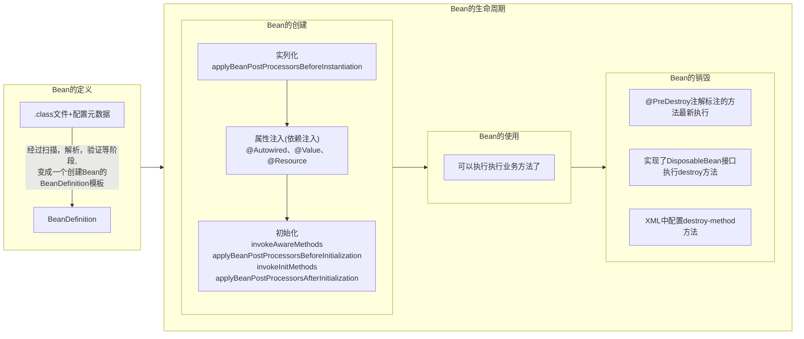

# SpringBean的生命周期

# 1.生命周期概览
Spring Bean生命周期有很多的说法和概念，以至于不好的去理解和记忆，变得像八股文，但是作为软件里的组件，总的来说还是可以总结为`创建`，`使用`和`销毁`的三个阶段。

Spring的Bean与Java的pojo有所不同，可以阅读org.springframework.beans.factory.config.BeanDefinition接口，Spring是给Java的pojo加了一层定义，方便后续Ioc容器处理的。

因此，Spring Bean的生命周期，可以总结为完成`Bean的定义`才可以开始生命周期，过程`Bean的创建`→`Bean的使用`→`Bean的销毁`.

整体过程如下：



# 2.Bean的定义
Spring容器启动时，加载@Component、@Bean、XML <bean>等Bean定义（BeanDefinition），解析成BeanDefinition对象（包含Bean的类名、属性、Scope、初始化方法等元数据）。

在bean的定义中，常见的应用场景：
* PropertySourcesPlaceholderConfigurer（处理 ${} 占位符）
* ConfigurationClassPostProcessor（处理 @Configuration）

这里需要需要知道三个类，我们可以根据这些去实现一些我们想要的效果，在bean初始化前，进行对bean定义处理。
+ org.springframework.beans.factory.config.BeanDefinition
+ org.springframework.beans.factory.config.BeanFactoryPostProcessor
+ org.springframework.beans.factory.support.BeanDefinitionRegistryPostProcessor
```java
// BeanDefinition 核心属性，这里只展示部分代码，具体以版本为主
public interface BeanDefinition extends AttributeAccessor, BeanMetadataElement {
    String SCOPE_SINGLETON = "singleton";
    String SCOPE_PROTOTYPE = "prototype";
    
    String getParentName();// 父 Bean 名称
    String getBeanClassName(); // Bean 类名
    String getScope();// 作用域
    boolean isLazyInit(); // 是否懒加载
    String[] getDependsOn(); // 依赖的 Bean
    ConstructorArgumentValues getConstructorArgumentValues(); // 构造参数
    MutablePropertyValues getPropertyValues();// 属性值
}

// 在 Bean 实例化之前，可以修改 Bean Definition 的定义。
@FunctionalInterface
public interface BeanFactoryPostProcessor {
    void postProcessBeanFactory(ConfigurableListableBeanFactory beanFactory) throws BeansException;
}

// 在 Bean 注册之前，可以修改 Bean Definition 的定义。
public interface BeanDefinitionRegistryPostProcessor extends BeanFactoryPostProcessor {
    void postProcessBeanDefinitionRegistry(BeanDefinitionRegistry registry) throws BeansException;
}
```

# 3.Bean的生命周期过程
## 3.1.Bean的创建
### 3.1.1.Bean的实列化
所谓的创建，大白话是new一个对象，Spring实例化策略，提供了两种策略，如下：

| 方式           | 说明                 | 适用场景       |
| -------------- | -------------------- | -------------- |
| **构造器反射** | 通过反射调用构造方法 | 默认方式       |
| **CGLIB 代理** | 使用 CGLIB 生成子类  | 需要方法注入时 |

可以参见接口：org.springframework.beans.factory.support.InstantiationStrategy
```java
public interface InstantiationStrategy {
	Object instantiate(RootBeanDefinition bd, 
                       @Nullable String beanName, 
                       BeanFactory owner) throws BeansException;

	Object instantiate(RootBeanDefinition bd, 
                       @Nullable String beanName, 
                       BeanFactory owner, 
                       Constructor<?> ctor, Object... args) throws BeansException;

	Object instantiate(RootBeanDefinition bd, 
                       @Nullable String beanName, 
                       BeanFactory owner, 
                       @Nullable Object factoryBean, 
                       Method factoryMethod, Object... args) throws BeansException;
}
```

这里需要补充一下Spring的Bean的作用域，以及bean定义时是否懒加载等，决定着Bean的初始化时机。

| 作用域                  | 描述                                                                                                                                |
|:---------------------|:----------------------------------------------------------------------------------------------------------------------------------|
| singleton（单例）        | （默认）为每个 Spring IoC 容器将单个 bean 定义限定为单个对象实例。                                                                                        |
| prototype（原型）        | 将单个 bean 定义限定为任意数量的对象实例。                                                                                                          |
| request（请求）          | 将单个 bean 定义限定为单个 HTTP 请求的生命周期。<br/>也就是说，每个 HTTP 请求都有其自己的 bean 实例，该实例根据单个 bean 定义创建。<br/>仅在 web 感知 Spring `ApplicationContext` 的上下文中有效。 |
| session（会话）          | 将单个 bean 定义限定为 HTTP `Session` 的生命周期。<br/>仅在 web 感知 Spring `ApplicationContext` 的上下文中有效。                                                |
| application          | application（应用）                                                                                                                   |
| websocket            | 将单个 bean 定义限定为 `WebSocket` 的生命周期。<br/>仅在 web 感知 Spring `ApplicationContext` 的上下文中有效。                                                   |

### 3.1.2.Bean的属性注入
属性填充，也叫依赖注入，属性注入完成后，Bean的基本状态才完整，主要有：
1. @Autowired 标注的字段
2. @Autowired 标注的 Setter 方法
3. @Autowired 标注的构造方法
4. @Value 注解的值注入
5. @Resource 注解的注入
### 3.1.3.Bean的初始化
Spring Bean的初始化阶段，提供了大量的扩展机制，让我们可以从容的去操作一些事情。
1. invokeAwareMethods
   
   这里主要是调用Aware接口，也就是Spring提供的感知接口，将容器的资源注入到Bean当中，常见的接口有：
    1. BeanNameAware
    2. BeanFactoryAware
    3. ApplicationContextAware
    4. EnvironmentAware
    5. ResourceLoaderAware
    6. ApplicationEventPublisherAware
2. applyBeanPostProcessorsBeforeInitialization

   这里主要是调用org.springframework.beans.factory.config.BeanPostProcessor#postProcessBeforeInitialization(Object bean, String beanName)
   关键特性：
   + 可以修改 Bean 实例,
   + 可以返回新的对象（通常用于创建代理）,
   + 可以跳过某些 Bean 的处理
3. invokeInitMethods
   判断是否是InitializingBean，然后调用afterPropertiesSet()方法，或是是否配置了init-method（注解或者XML配置的）
4. applyBeanPostProcessorsAfterInitialization

   **AOP 代理创建的关键阶段，完成这一步，也就完成bean的创建了，也标记这完成AOP的代理**

   这里主要是调用org.springframework.beans.factory.config.BeanPostProcessor#postProcessAfterInitialization(Object bean, String beanName)

上述4个阶段，如果太难记忆，看看代码就清楚了，跳转进入org.springframework.beans.factory.support.AbstractAutowireCapableBeanFactory的initializeBean方法
```java
	protected Object initializeBean(final String beanName, final Object bean, @Nullable RootBeanDefinition mbd) {
		if (System.getSecurityManager() != null) {
			AccessController.doPrivileged((PrivilegedAction<Object>) () -> {
				invokeAwareMethods(beanName, bean);
				return null;
			}, getAccessControlContext());
		}
		else {
            // 1.调用Aware接口
			invokeAwareMethods(beanName, bean); 
		}

		Object wrappedBean = bean;
		if (mbd == null || !mbd.isSynthetic()) {
            // 2.调用前置方法，可以创建带来对象
			wrappedBean = applyBeanPostProcessorsBeforeInitialization(wrappedBean, beanName);
		}

		try {
            // 3.调用初始化方法
			invokeInitMethods(beanName, wrappedBean, mbd);
		}
		catch (Throwable ex) {
			throw new BeanCreationException(
					(mbd != null ? mbd.getResourceDescription() : null),
					beanName, "Invocation of init method failed", ex);
		}
		if (mbd == null || !mbd.isSynthetic()) {
            // 4.调用后置方法，可以增强对象，也是就AOP
			wrappedBean = applyBeanPostProcessorsAfterInitialization(wrappedBean, beanName);
		}
		return wrappedBean;
	}
```

## 3.2.Bean的使用
完成上述的创建阶段，我们就可以使用我们的bean了，例如使用上下文getBean，或者执行业务方法等等。

## 3.3.Bean的销毁
容器即将关闭，或者JVM退出，Spring会触发销毁的准备。我们可以执行自定义的销毁逻辑（关闭连接池、打印日志、释放资源等）。

销毁的3种方式（执行顺序从先到后）：
1. @PreDestroy注解（JSR-250规范）：标注在非静态方法上。
2. DisposableBean接口（Spring自带）：实现destroy()方法。
3. destroy-method配置：通过XML <bean destroy-method="destroy">或@Bean(destroyMethod = "destroy")指定。

# 4.Spring Bean生命周期的全流程
进入[org.newjiang.springboot.lifecycle](src%2Fmain%2Fjava%2Forg%2Fnewjiang%2Fspringboot%2Flifecycle)，执行[BeanLifeCycleApplication.java](src%2Fmain%2Fjava%2Forg%2Fnewjiang%2Fspringboot%2Flifecycle%2FBeanLifeCycleApplication.java)

打印的日志如下：
```text
spring bean cycle start >>>>>>>>>>>>>>>>>>>>>>>>>>>>>>>>>>>>>>>>>>>>>>>>>>>>>>>>>>>>>>>>>
BeanDefinitionRegistryPostProcessor.postProcessBeanDefinitionRegistry >>> getBeanLifeCycle
BeanDefinitionRegistryPostProcessor.postProcessBeanFactory >>> getBeanLifeCycle
创建阶段：1. 实例化：构造器执行
创建阶段：2. 属性注入：beanLifeCycleService已注入
创建阶段：3. Aware接口：Bean名称为getBeanLifeCycle
BeanPostProcessor：初始化前增强
创建阶段(初始化)：4. 初始化：@PostConstruct执行
创建阶段(初始化)：5. 初始化：InitializingBean执行
创建阶段(初始化)：6. 初始化：init-method执行
BeanPostProcessor：初始化后增强
7. 使用：Bean正在工作
销毁阶段：8. 销毁：@PreDestroy执行
销毁阶段：9. 销毁：DisposableBean执行
销毁阶段：10. 销毁：destroy-method执行
spring bean cycle end   >>>>>>>>>>>>>>>>>>>>>>>>>>>>>>>>>>>>>>>>>>>>>>>>>>>>>>>>>>>>>>>>>
```