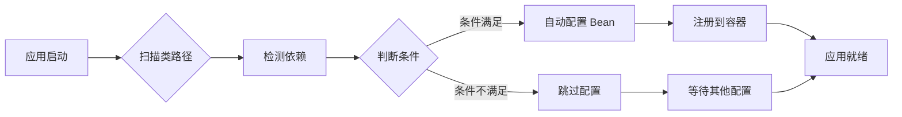
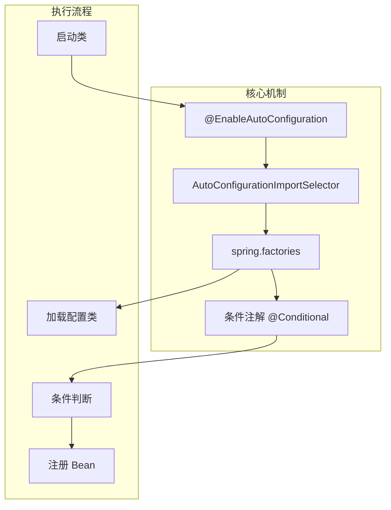
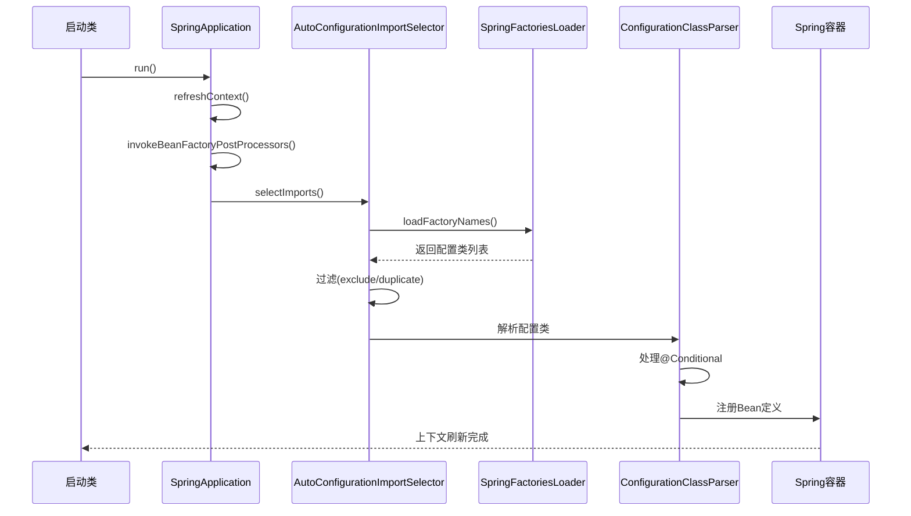
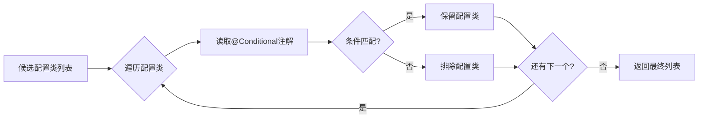
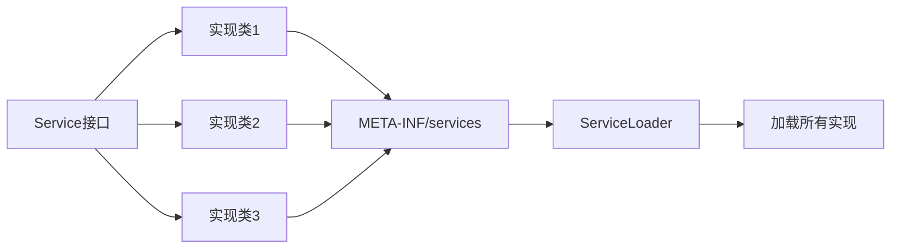

# SpringBoot自动装配原理

[toc]

# 1.SpringBoot自动装配简介

Spring Boot 自动装配（Auto-Configuration）是 Spring Boot 框架的核心特性之一，它通过`约定优于配置`的理念，根据类路径中的 jar 包、类以及其他条件，自动配置 Spring 应用程序上下文中的 Bean。

对比传统的Spring配置：


| 特性       | 传统 Spring             | Spring Boot 自动装配 |
| ---------- | ----------------------- | -------------------- |
| 配置方式   | 手动 XML 或 Java Config | 自动 + 按需配置      |
| 依赖管理   | 手动管理版本            | 起步依赖（Starter）  |
| 配置复杂度 | 高                      | 低                   |
| 开发效率   | 较低                    | 极高                 |

核心设计理念：



# 2.自动装配的核心原理

Spring Boot 应用启动时，通过以下步骤触发自动装配：

1. @SpringBootApplication 注解组合了 @EnableAutoConfiguration
2. AutoConfigurationImportSelector 读取 spring.factories
3. 条件注解 判断是否满足配置条件
4. Bean 定义注册 到 Spring 容器

核心机制:



完整流程图:



# 3.源码解读

1. @SpringBootApplication 组合注解

```java
@Target(ElementType.TYPE)
@Retention(RetentionPolicy.RUNTIME)
@Documented
@Inherited
@SpringBootConfiguration
@EnableAutoConfiguration // 关键注解
@ComponentScan(excludeFilters = {@Filter(type = FilterType.CUSTOM, classes = TypeExcludeFilter.class),
		@Filter(type = FilterType.CUSTOM, classes = AutoConfigurationExcludeFilter.class) })
public @interface SpringBootApplication {}
```

2. @EnableAutoConfiguration 详解

```java
@Target(ElementType.TYPE)
@Retention(RetentionPolicy.RUNTIME)
@Documented
@Inherited
@AutoConfigurationPackage
@Import(AutoConfigurationImportSelector.class) // 关键Import
public @interface EnableAutoConfiguration {
	String ENABLED_OVERRIDE_PROPERTY = "spring.boot.enableautoconfiguration";
	Class<?>[] exclude() default {};
	String[] excludeName() default {};
}
```

## 3.1.AutoConfigurationImportSelector解读

+ selectImports方法

```java
	@Override
	public String[] selectImports(AnnotationMetadata annotationMetadata) {
        // 1. 检查是否启用自动配置
		if (!isEnabled(annotationMetadata)) {
			return NO_IMPORTS;
		}
      
        // 2. 获取自动配置条目，加载spring.factories以及对应的Configuration配置类
		AutoConfigurationMetadata autoConfigurationMetadata 
                = AutoConfigurationMetadataLoader.loadMetadata(this.beanClassLoader);
		AutoConfigurationEntry autoConfigurationEntry 
                = getAutoConfigurationEntry(autoConfigurationMetadata, annotationMetadata);

        // 3. 返回配置类数组
		return StringUtils.toStringArray(autoConfigurationEntry.getConfigurations());
	}
```

+ getAutoConfigurationEntry方法

```java
protected AutoConfigurationEntry getAutoConfigurationEntry(AutoConfigurationMetadata autoConfigurationMetadata,
        AnnotationMetadata annotationMetadata) {
    if (!isEnabled(annotationMetadata)) {
        return EMPTY_ENTRY;
    }
    AnnotationAttributes attributes = getAttributes(annotationMetadata);
  
    // 1. 获取所有候选配置类，会通过SpringFactoriesLoader去加载spring.factories
    List<String> configurations = getCandidateConfigurations(annotationMetadata, attributes);
  
    // 2.去重和排除
    configurations = removeDuplicates(configurations);
    Set<String> exclusions = getExclusions(annotationMetadata, attributes);
    checkExcludedClasses(configurations, exclusions);
    configurations.removeAll(exclusions);
  
    // 3.过滤（条件判断）
    configurations = filter(configurations, autoConfigurationMetadata);
  
    // 4.触发事件
    fireAutoConfigurationImportEvents(configurations, exclusions);
    return new AutoConfigurationEntry(configurations, exclusions);
}
```

条件和判断：



# 4.条件注解体系


**Spring Boot 提供了丰富的条件注解，用于控制自动配置的生效条件：**

## 4.1 类路径条件


| **注解**                          | **说明**                          | **示例**                                          |
| --------------------------------- | --------------------------------- | ------------------------------------------------- |
| **@ConditionalOnClass**           | **类路径存在指定类**              | `@ConditionalOnClass(DataSource.class)`           |
| **@ConditionalOnMissingClass**    | **类路径不存在指定类**            | `@ConditionalOnMissingClass(Servlet.class)`       |
| **@ConditionalOnSingleCandidate** | **容器中只有一个指定类型的 Bean** | `@ConditionalOnSingleCandidate(DataSource.class)` |

## 4.2 Bean 条件


| **注解**                      | **说明**                  | **示例**                                          |
| ----------------------------- | ------------------------- | ------------------------------------------------- |
| **@ConditionalOnBean**        | **容器中存在指定 Bean**   | `@ConditionalOnBean(name="dataSource")`           |
| **@ConditionalOnMissingBean** | **容器中不存在指定 Bean** | `@ConditionalOnMissingBean(UserService.class)`    |
| **@ConditionalOnExpression**  | **SpEL 表达式结果**       | `@ConditionalOnExpression("${app.enabled:true}")` |

## 4.3 配置属性条件


| **注解**                   | **说明**                   | **示例**                                                |
| -------------------------- | -------------------------- | ------------------------------------------------------- |
| **@ConditionalOnProperty** | **配置属性存在且满足条件** | `@ConditionalOnProperty(prefix="app", name="enabled")`  |
| **@ConditionalOnResource** | **类路径存在指定资源**     | `@ConditionalOnResource("classpath:config.properties")` |

## 4.4 Web 应用条件


| **注解**                            | **说明**          | **示例**                                            |
| ----------------------------------- | ----------------- | --------------------------------------------------- |
| **@ConditionalOnWebApplication**    | **是 Web 应用**   | `@ConditionalOnWebApplication(type = Type.SERVLET)` |
| **@ConditionalOnNotWebApplication** | **不是 Web 应用** | `@ConditionalOnNotWebApplication`                   |

## 4.5 其他条件


| **注解**                        | **说明**           |
| ------------------------------- | ------------------ |
| **@ConditionalOnJava**          | **Java 版本条件**  |
| **@ConditionalOnWarDeployment** | **War 包部署条件** |
| **@ConditionalOnCloudPlatform** | **云平台条件**     |

# 5.SPI 机制与 spring.factories
Java SPI 机制：

Spring Boot 的扩展 SPI:

Spring Boot 在 Java SPI 基础上进行了扩展，使用 spring.factories 文件
```text
META-INF/spring.factories
META-INF/spring/org.springframework.boot.autoconfigure.AutoConfiguration.imports (Spring Boot 2.7+)
```
不同版本方式不同，作用还是一样的。
